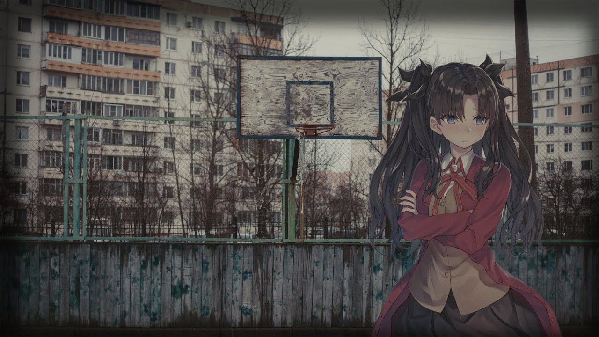

#   Проект лабораторной работы №2 по дисциплине "Системы копьютерного зрения"
##  Основная информация о задании
&ensp; В рамках данной работы было необходимо реализовать методы поиска и сопоставления опорных точек на двух изображениях, имеющих друг относительно друга смещение.

##  Выбор метода обнаружения
&ensp; Во многом мы ограничены двумя вариантами с некоторым числом модификаций внутри них.

&ensp; Первый варант - поиск углов. Данный метод хорошо работает с изображениями, имеющими достаточно явно выраженные прямые линии и, соответсвенно, углов, образуемых между ними. Чаще всего их применяют для поиска геометрических фигур или сопоставления изображений зданий, панормамм городов или прочих изображений, где будет большое число прямых (или близких к ним) линий.

&ensp; Второй варинат - блобы. Блобы представляют собой некоторую область, которая является достаточно отличительной на фоне остального изображения и может быть сравнительно лего детектированна. Если найти на изображении А набор таких областей, то при незначительных изменениях, с высокой вероятностью все или большая часть этих областей может быть детектирована на изображении B (если мы применяем одинаковые алгоритмы). Однако, стоит заметить, что данный метод не совершенен и часто при сильных изменениях изображений будет происходить серьёзное изменение числа или положения этих самых блобов, что делает невозможность сопоставления блобов. Из особенностей стоит отметить, что у него единственное требование - наличие каких-либо особенностей (переходов яркости, цветовых переходов) на изображении, чтобы их можно было считать этими особыми точками.

&ensp; Для решения задачи в данном проекте будет применятсья метод блобов, так как он более универсален и больше подходит для изображений с не явно выраженными прямыми линиями.

##  Описание хода работы
#   Искажение исходного изображения

&ensp; Для работы было взято случайно изображение с интернета, сложность работы с которым заранее является высокой ввиду однотонности палитры и малого числа объектов, за которые дейсвтительно можно зацепиться блобами (но было бы лего зацепиться фильтром углов). Изображение приведено ниже и оно имеет размер 1280x720.

&ensp; Чтобы исказить изображение, достаточно поменять его яркость или же как-то сместить пиксели. Для внесения изменений в изображении было использован сервис yodayo, а конкретно функция расширения изображения. Исходное изображение было загружено и увеличено до размеров 1865x1227. Новые пиксели были созданы генератором изображения и, фактически, просто дополнили исходную картину, не затронув её. Стоит отметить, что метод может быть не идеален, так как иходное изображение может быть подвергнуто изменению по гамме, более того, исходное изображение было в формтае jpg, а выходное - png, которое потом конвертировалось в jpg.

&ensp; Дополненное изображение представлено ниже.

