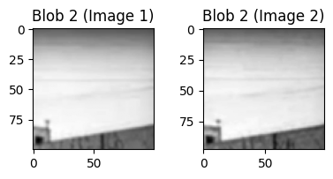
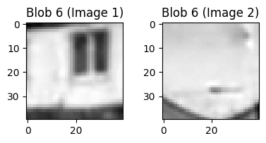
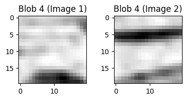
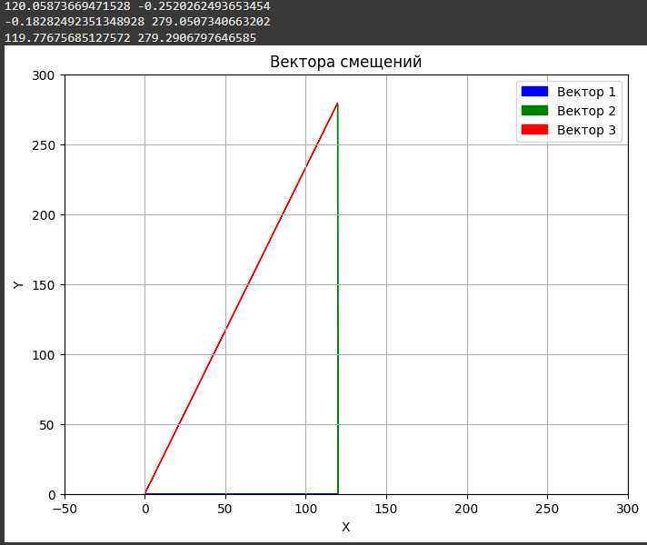

#   Проект лабораторной работы №2 по дисциплине "Системы копьютерного зрения"
##  Основная информация о задании
&ensp; В рамках данной работы было необходимо реализовать методы поиска и сопоставления опорных точек на двух изображениях, имеющих друг относительно друга смещение.

##  Выбор метода обнаружения
&ensp; Во многом мы ограничены двумя вариантами с некоторым числом модификаций внутри них.

&ensp; Первый варант - поиск углов. Данный метод хорошо работает с изображениями, имеющими достаточно явно выраженные прямые линии и, соответсвенно, углов, образуемых между ними. Чаще всего их применяют для поиска геометрических фигур или сопоставления изображений зданий, панормамм городов или прочих изображений, где будет большое число прямых (или близких к ним) линий.

&ensp; Второй варинат - блобы. Блобы представляют собой некоторую область, которая является достаточно отличительной на фоне остального изображения и может быть сравнительно лего детектированна. Если найти на изображении А набор таких областей, то при незначительных изменениях, с высокой вероятностью все или большая часть этих областей может быть детектирована на изображении B (если мы применяем одинаковые алгоритмы). Однако, стоит заметить, что данный метод не совершенен и часто при сильных изменениях изображений будет происходить серьёзное изменение числа или положения этих самых блобов, что делает невозможность сопоставления блобов. Из особенностей стоит отметить, что у него единственное требование - наличие каких-либо особенностей (переходов яркости, цветовых переходов) на изображении, чтобы их можно было считать этими особыми точками.

&ensp; Для решения задачи в данном проекте будет применятсья метод блобов, так как он более универсален и больше подходит для изображений с не явно выраженными прямыми линиями.

##  Описание хода работы
#   Искажение исходного изображения

&ensp; Для работы было взято случайно изображение с интернета, сложность работы с которым заранее является высокой ввиду однотонности палитры и малого числа объектов, за которые дейсвтительно можно зацепиться блобами (но было бы лего зацепиться фильтром углов). Изображение приведено ниже и оно имеет размер 1280x720.

&ensp; Чтобы исказить изображение, достаточно поменять его яркость или же как-то сместить пиксели. Для внесения изменений в изображении было использован сервис yodayo, а конкретно функция расширения изображения. Исходное изображение было загружено и увеличено до размеров 1865x1227. Новые пиксели были созданы генератором изображения и, фактически, просто дополнили исходную картину, не затронув её. Стоит отметить, что метод может быть не идеален, так как иходное изображение может быть подвергнуто изменению по гамме, более того, исходное изображение было в формтае jpg, а выходное - png, которое потом конвертировалось в jpg.

&ensp; Дополненное изображение представлено ниже.

&ensp; На этом модификация изображений остановлена, переходим к непосредственно блобам.

#   Алгоритм обнаружения блобов (blob)

### Бинаризация

&ensp; Перед бинаризацией изображение загружается в тонах серого и обрабатывается гаусовым фильтром, чтобы создать эффект размытия и тем самым потенциально уменьшая число областей малого размера (в дальнейшем окажется, что областей создаётся всё равно слишком много).

&ensp; Как ранее говорилось - блоб - это особая область, которая отличается или выделяется на фоне остального изображения (если быть вернее, в определённой его окрестности). Для подобной задачи работа с цветным, цифровым изображением, крайне неудобна ввиду того, что изображение содержит огромное количество информции. Поэтому для упрощения работы предварительно оба изображения будут бинаризоваться, ранее мы рассматривали как работает данный алгоритм в лабораторной работе №1. Стоит отметить, что исходное изображениие далее будет обозначаться как изображение 1 и искажённое (расширенное) как изображение 2. Результат бинаризации обоих изображений представлен ниже.

&ensp; Стоит замтеить, что важно подобрать порог бинаризации (threshold), так как в зависимости от него в итоге будет получатсья разное количество и качество областей (об этом будет далее). При низком пороге - у нас будет больше областей и при этом будут поподать шумы. При высоком пороге - будет меньше областей (но не всегда) и, возможно, что часть областей будут поглащать друг друга, сливаясь в одну область (такое не исключено и при низком пороге, так как сильно зависит от особенностей изображения).

### Определение связей

&ensp; Данный этап нужен для того, чтобы разбить бинаризированное изображение на набор связанных блоков пикселей. Которые, фактически, будут формировать областит, которые в дальнейшем будут анализироваться. 

&ensp; Для определения связей использовалась функция label из библиотеки scipy.ndimage. Как итог, на выходе получается массив размером с изображение, состоящий из чисел в диапозоне от 0 до N, где N - число обнаруженных связанных пикселей (формирующих область N). Поэтому пятно пикселей с значением 1, будут формировать область номер 1. Пятно из пикселей с значением 2 - будет формировать область номер 2 и так далее.

&ensp; Так же можно рассматривать несколько видов связей, в частности, 4 или 8 связность, в первом случаи пиксель считается связанным, если он контактирует с другими такими же пикселями по какой либо из сторон. В втором случаи к условию добавляются диагонали и достаточно, чтобы углы пикселей, а не стороны, касались друг друга.

&ensp; Ниже приведены графические отображения работы алгоритма. Для изображения 1.

&ensp; &ensp; &ensp; &ensp; &ensp; &ensp; &ensp; &ensp; &ensp; &ensp; &ensp; &ensp;  

&ensp; В данном случаи был сделан цветной градиент, где каждый цвет или его оттенок показывает принадлежность к той или иной области.

&ensp; Так же был выведен список всех областей с числом пикселей, так как по цветной шкале трудно понять, скольок всего было обнаружено областей, но на основе выводимый справочойно информации можно сделать вывод, что было сформировано около 397 областей. Однако многие из них состоят из всего лишь пары пикселей или пары десятков, такие блобы мы не увидим графически, но при этом они составляют большую часть изображения.

&ensp; Ниже приведены графические отображения работы алгоритма. Для изображения 2.

&ensp; &ensp; &ensp; &ensp; &ensp; &ensp; &ensp; &ensp; &ensp; &ensp; &ensp; &ensp; 

&ensp; Здесь же, несмотря на расширение изображения, было сформированно всего 334 области, что меньше, чем на первом изображении. Вероятнее всего, исходное изображение было искажено в генераторе краёв и при измеении форматов. Однако, для текущей задачи это не кретично.

### Фильтрация областей (блобов)

&ensp; Как было ранее сказанно, метод связей обнаружил около 300-400 связанных областей, каждая из которых могла бы стать потенциальным блобом. Однако, работать с таким числом точек было бы крайне неудобно, более того, достаточно большчая их часть представляет собой области в несколько пикселей, а другие - в несколько сотен пикселей. Как итог, вводится пороговое значение на минимальнуб площадь блоба (min_area), задаваемую пользователем. В данном с случаи при значении в 310 пикселей были достигнуты приемлемые результаты. Все блобы, которые меньше данного размера, не учитываются.

&ensp; При этом как определяются сами области ? Создаются двумерный массив размерностью 2 на N (где N - число пикселей входящих в область). В данном массиве содержатся координаты всех пикселей, входящих в область. После определяется площадь области (достаточно взять число элементов в любом столбце). После вычисляются центры областей на основе массива X и массива Y координат пикселей.

### Сопоставление блобов

&ensp; После того, как была проведена работа по фильтрации областей, было вычисленно число блобов, с которыми будем в дальнейшем работать. Для первого изображения это -, и для второго -.

&ensp; Теперь необходимо сопостваить блобы, чтобы по ним в дальнейшем можно было сопоставлять изображения  и/или объекты. Стоит заметить, что все блобы имеют набор индивидуальных параметров, которые позволят их сравнивать между собой. Всего можно выделить около 6 параметров:

&ensp; Параметры блобов:

1. Площадь блоба
2. Средняя интексивность пикселей
3. Гистогрмма локальных бинарных шаблонов
4. Список расстояний до других ближайших блобов
5. Список углов до других ближайших блобов

&ensp; Первые два параметр являются достаточно простыми. Так как площадь блоба - число пикселей. Среднияя интенсивность пикселей - отношение суммы яркостей всех пикселей к числу пикселей.

&ensp; Рассмотрим как вычисляются расстоянияя до блобов. Сперва вычисляется абсолютная удалённость центров масс блобов друг от друга за счёт вычисления Евкливдова расстояния между ними. Однако, этот метод чувствителен к изменению масштаба, поэтмоу после поделим вычисленно расстояние на длину или ширину изображения (берём наибольший параметр). Таким образом будет вычислять рассятоние от одного блоба до трёх других ближайших блобов.

&ensp;  Рассмотрим как вычисляются углы до блобов. По аналогии с прошолым методом, вычисления происходят до трёх ближайших блобов. Вычисление происходит с применением функции np.arctan(), где на вход подаётся разность координат центров масс блобов по x и y. Однако данная функция вычисляет в радианы, для перевода в обычные углы применяется выражение np.arctan() / (2 * np.pi). Что позволяет получить информацию об углах между блобами. 

&ensp; Рассмотрим более подробно ряд параметров, в частности, гистограмму локальных бинарных шаблонов. В анализ попадает не весь блоб, а определённа зона вокруг его центра масс. Размер зоны вычисляется на основе следующих выражений, исходя из предположения, что блоб стремиться к округлой форме и будет вписан в прямоугольник. Спервы вычислим радиус блоба, для этого будем использовать следующую формулу - np.sqrt(S / np.pi). Где S - площадь блоба в пикселях. После определяем границы прямоугольника, относительно центра масс. Стороны прямоугольника будут удалены от центра масс на вычисленный ранее радиус и будут формировать квадрат, который и будет нашим шаблоном. Внутри данного шаблона берётся пиксель, а после анализируется его окрестность на каком-то заранее заданном радиусе. Берётся пиксель и анализируются пиксели вокруг него в порядке обхода по часовой стрелке, если их яркость меньше, чем у центрального пикселя, то присваивается значение 0, иначе - 1. После обхода все данные значения будут формировать битовую последовательность, которая и будет представлять собой численное значение для данного пикселя. После того, как это будет сделано с всей область, будет составлена гистограмма для данной области, чтобы узнать, пиксели с какими значением LBP встречаются чаще всего. После на основе данной информации будут происходить сравнения.

&ensp; На основе данных параметро происходит после вычисление степени схожести блобов на основе суммы параметров с весовыми коэффициентами и их вычитание от еденицы, чтобы узнать степень схожести блобов, а после сделать вывод об их идентичности.

&ensp; После этого блобам ни двух изображениях присваются номера, согласно их парам, то есть блобы с номерами 1 на первом и втором изображении должны быть идентичным. В плане визуализацию юерётся область - центр блоба с определённым радиусом.

&ensp; Как итог, изображение ниже наглядно показывает работу алгоритмов, обозначая зоны блобов.

&ensp; Можно заметить, что блобы найденные на одном изображении, соответсвуют блобам на другом изображении и их номера совпадают. Это может быть не видно на изображении, однако, рассматривая набор сравнений можно увидеть, что области очень похожи или даже идентичны, что говорит о исправной работе алгоритма.

 &ensp; &ensp; &ensp; &ensp; &ensp; &ensp; &ensp; &ensp; &ensp; &ensp; &ensp; &ensp;  &ensp; &ensp; &ensp; &ensp; &ensp; &ensp; &ensp; &ensp; &ensp; &ensp; &ensp; &ensp;  &ensp; 

&ensp; &ensp; &ensp; &ensp; &ensp; &ensp; &ensp; &ensp; &ensp; &ensp; &ensp; &ensp;  &ensp; &ensp; &ensp; &ensp; &ensp; &ensp; &ensp; &ensp; &ensp; &ensp; &ensp; &ensp;  &ensp; 

&ensp; &ensp; &ensp; &ensp; &ensp; &ensp; &ensp; &ensp; &ensp; &ensp; &ensp; &ensp;  &ensp; &ensp; &ensp; &ensp; &ensp; &ensp; &ensp; &ensp; &ensp; &ensp; &ensp; &ensp;  &ensp; 

&ensp; &ensp; &ensp; &ensp; &ensp; &ensp; &ensp; &ensp; &ensp; &ensp; &ensp; &ensp;  &ensp; &ensp; &ensp; &ensp; &ensp; &ensp; &ensp; &ensp; &ensp; &ensp; &ensp; &ensp;  &ensp; 

&ensp; На этом работа с алгоритмом обнаружения и распознания блобов закончена, теперь переходим к выполнению основной части задания - определение смещений и углов поворотов.

## Определение смещений и углов

### Новые изображения

&ensp; Теперь, когда мы можем находить устойчиво блобы, необходимо проаналоизировать эти блобы, чтобы вычислить смещение. Для начала сменим изображения, так как созданные ранее растянутое изображение не позволяет сказать что-то относительно смещения картинки. С позиционирвоанием блобов, скорее можно будет сделать вывод о том, что положение изображения не изменилось или изменилось незначительно. Поэтому добавим набор новых изображений, с смещением по оси X и с комбинированным смещением по X и по Y (смещение по X - эквивалентно первому смещению).

&ensp; Ниже приведено изображением с смещением влево на 120 пикселей (крайняя левая часть была сгенерирована нейросетью).

&ensp; Ниже приведено изображение, являющееся модификацией предыдущего, где было добавлено смещение на 280 пикселей вверх (относительно исходного изображения - имеется смещение на 120 пикселей влево и на 280 пикселей вверх).

### Идея метода определения смещений

&ensp; Так как мы можем корректно (в большинстве случаев) сопоставлять блобы, то всё что остаётся - вычислить смещение в изображении на основе разницы координат центров блобов. Однако, данный метод может применяться так как все изображения имеют одинаковый размер.

&ensp; Просто линейное вычисление между блобами может дать неверный результат или, вернее, приблежённый, так как определить координаты для блобов с точностью до пикселя крайне сложная задача. Более того, мы не можем оценить точность определения координат в рамках задачи, так как не на что сверяться, при этом нужно учитывать возможность ложных присвоений. Для невелирования неточностей определения координат блобов и возможных выбросов - лучше всего подойдёт метод RANSAC.

&ensp; Данный метод будет выбирать набор двух блобов на изображении 1 и сравнивать его с аналогичным набором на изображении 2. Будет вычислятсья середина разницы координат по X и Y между этими двумя парами ( dx = (blobs1[i1][0] - blobs2[j1][0] + blobs1[i2][0] - blobs2[j2][0]) / 2
dy = (blobs1[i1][1] - blobs2[j1][1] + blobs1[i2][1] - blobs2[j2][1]) / 2 ). После необходимо сопоставить координат блобов на изображении 1 с расчётными координатами блобов на изображении 2, которые вычисляются на основе найденных ранее dx и dy на основе следующих выражений. Нас интересует ошибка, так как идеального совпадения, скорее всего, не будет. Поэтому необходимо вычислять ошибку по следующему выражению error = np.sqrt((x2 - x1 + dx)**2 + (y2 - y1 + dy)**2) и, если, ошибка меньше порогового значения, то считать данный блоб верно определённым.

&ensp; Метод сводится к перебору N числа комбинаций пар блобов, с определённым лимитом (в данном случаи был установлен лимит в 1000 итераций), после чего подсчитывается число успешно определённых блобов для каждой модели. И модель, определившая больше всего блобов, фактически, будет давать результат смещения изображения в величинах X и Y (dx и dy) соотвественно.

### Результат работы алгоритмов

&ensp; Возьмём набор изображений. 1 - исходное, 2 - с смещением по X, 3 - с смещением по X (аналогично 2-му изображению) и с смещением по Y.

&ensp; Теперь проанализируем их попарно в комбинациях 1-2, 2-3. Что должно будет дать вектора направлений их смещений друг относительно друга.

&ensp; Теперь алгоритм будет применяться один для всех пар изображений с одинаковыми коэффициентами и порогами, то есть он настроен не на каждое изображение в совершенстве, а на набор изображений.

&ensp; Как мы видим, часть блобов сопоставлена неверно, однако, алгоритм смог кооректно определить направление и величину смещения. Данное изображение (2) имеет относительно изображения 1 смещение на 120 пикселей в право, что и поазывает надпись под стрелкой. Рассмотрим набор блобов и их сравнение.

&ensp; &ensp; &ensp; &ensp; &ensp; &ensp; &ensp; &ensp; &ensp; &ensp; &ensp; &ensp;  &ensp; &ensp; &ensp; &ensp; &ensp; &ensp; &ensp; &ensp; &ensp; &ensp; &ensp; 

&ensp; &ensp; &ensp; &ensp; &ensp; &ensp; &ensp; &ensp; &ensp; &ensp; &ensp; &ensp;  &ensp; &ensp; &ensp; &ensp; &ensp; &ensp; &ensp; &ensp; &ensp; &ensp; &ensp; 

&ensp; &ensp; &ensp; &ensp; &ensp; &ensp; &ensp; &ensp; &ensp; &ensp; &ensp; &ensp;  &ensp; &ensp; &ensp; &ensp; &ensp; &ensp; &ensp; &ensp; &ensp; &ensp; &ensp; 

&ensp; &ensp; &ensp; &ensp; &ensp; &ensp; &ensp; &ensp; &ensp; &ensp; &ensp; &ensp;  &ensp; &ensp; &ensp; &ensp; &ensp; &ensp; &ensp; &ensp; &ensp; &ensp; &ensp; 

&ensp; &ensp; &ensp; &ensp; &ensp; &ensp; &ensp; &ensp; &ensp; &ensp; &ensp; &ensp;  &ensp; &ensp; &ensp; &ensp; &ensp; &ensp; &ensp; &ensp; &ensp; &ensp; &ensp; 

&ensp; &ensp; &ensp; &ensp; &ensp; &ensp; &ensp; &ensp; &ensp; &ensp; &ensp; &ensp;  &ensp; &ensp; &ensp; &ensp; &ensp; &ensp; &ensp; &ensp; &ensp; &ensp; &ensp; 

&ensp; &ensp; &ensp; &ensp; &ensp; &ensp; &ensp; &ensp; &ensp; &ensp; &ensp; &ensp;  &ensp; &ensp; &ensp; &ensp; &ensp; &ensp; &ensp; &ensp; &ensp; &ensp; &ensp; 

&ensp; &ensp; &ensp; &ensp; &ensp; &ensp; &ensp; &ensp; &ensp; &ensp; &ensp; &ensp;  &ensp; &ensp; &ensp; &ensp; &ensp; &ensp; &ensp; &ensp; &ensp; &ensp; &ensp; 

&ensp; &ensp; &ensp; &ensp; &ensp; &ensp; &ensp; &ensp; &ensp; &ensp; &ensp; &ensp;  &ensp; &ensp; &ensp; &ensp; &ensp; &ensp; &ensp; &ensp; &ensp; &ensp; &ensp; 

&ensp; &ensp; &ensp; &ensp; &ensp; &ensp; &ensp; &ensp; &ensp; &ensp; &ensp; &ensp;  &ensp; &ensp; &ensp; &ensp; &ensp; &ensp; &ensp; &ensp; &ensp; &ensp; &ensp; 

&ensp; Можно увидеть, что часть сопоставленных блобов абсполютно не похожие между собой, однако, алгоритм смог вполне кооректно определить направление и велечину смещения, во многом это благодаря методы RANSAC с анализом всех пар точек относительно всех.

&ensp; Теперь рассмотрим пару изображений 2 и изображения 3, имеющего относительно друг друга тольо Y смещение.

&ensp; Как мы видим, часть блобов сопоставлена неверно, снова. При этом их число достаочно большое. Однако алгоритм достаточно точно определяет вектор смещения и имеет ошибку в пару пикселей.

&ensp; &ensp; &ensp; &ensp; &ensp; &ensp; &ensp; &ensp; &ensp; &ensp; &ensp; &ensp;  &ensp; &ensp; &ensp; &ensp; &ensp; &ensp; &ensp; &ensp; &ensp; &ensp; &ensp; 

&ensp; &ensp; &ensp; &ensp; &ensp; &ensp; &ensp; &ensp; &ensp; &ensp; &ensp; &ensp;  &ensp; &ensp; &ensp; &ensp; &ensp; &ensp; &ensp; &ensp; &ensp; &ensp; &ensp; 

&ensp; &ensp; &ensp; &ensp; &ensp; &ensp; &ensp; &ensp; &ensp; &ensp; &ensp; &ensp;  &ensp; &ensp; &ensp; &ensp; &ensp; &ensp; &ensp; &ensp; &ensp; &ensp; &ensp; 

&ensp; &ensp; &ensp; &ensp; &ensp; &ensp; &ensp; &ensp; &ensp; &ensp; &ensp; &ensp;  &ensp; &ensp; &ensp; &ensp; &ensp; &ensp; &ensp; &ensp; &ensp; &ensp; &ensp; 

&ensp; &ensp; &ensp; &ensp; &ensp; &ensp; &ensp; &ensp; &ensp; &ensp; &ensp; &ensp;  &ensp; &ensp; &ensp; &ensp; &ensp; &ensp; &ensp; &ensp; &ensp; &ensp; &ensp; 

&ensp; &ensp; &ensp; &ensp; &ensp; &ensp; &ensp; &ensp; &ensp; &ensp; &ensp; &ensp;  &ensp; &ensp; &ensp; &ensp; &ensp; &ensp; &ensp; &ensp; &ensp; &ensp; &ensp; 

&ensp; &ensp; &ensp; &ensp; &ensp; &ensp; &ensp; &ensp; &ensp; &ensp; &ensp; &ensp;  &ensp; &ensp; &ensp; &ensp; &ensp; &ensp; &ensp; &ensp; &ensp; &ensp; &ensp; 

&ensp; &ensp; &ensp; &ensp; &ensp; &ensp; &ensp; &ensp; &ensp; &ensp; &ensp; &ensp;  &ensp; &ensp; &ensp; &ensp; &ensp; &ensp; &ensp; &ensp; &ensp; &ensp; &ensp; 

&ensp; &ensp; &ensp; &ensp; &ensp; &ensp; &ensp; &ensp; &ensp; &ensp; &ensp; &ensp;  &ensp; &ensp; &ensp; &ensp; &ensp; &ensp; &ensp; &ensp; &ensp; &ensp; &ensp; 

&ensp; &ensp; &ensp; &ensp; &ensp; &ensp; &ensp; &ensp; &ensp; &ensp; &ensp; &ensp;  &ensp; &ensp; &ensp; &ensp; &ensp; &ensp; &ensp; &ensp; &ensp; &ensp; &ensp;  

&ensp; Вынесем теперь вектора смещений в координатную плоскость и сопоставим, результат представлен ниже.

&ensp; Из векторов видно, что их размеры определены верно (еденицы измерения направлений векторов - пиксели) и при этом они действительно имеют смещения по X и Y. Алгоритм работает корректно, однако, отработает ли он корректно при смещении по X и Y одновременно ? Чтобы это првоерить, достаточно пропустить обработу изображения 2. То есть сразу сравнить изображение 1 и изображение 3, тогда, получится, что изображение 3 имеет относительно изображения 2 изменение по X и Y. Сделаем это и посмотрим на результат.

&ensp; Как мы видим, всего было обнаружено 3 блоба, однако, все они определены верно, что позволит без труда установить линейные смещения. Видно, что определён вектор смещений по X и Y с размерностью в 120 и 280, что говорит о корректности работы алгоритмов даже для смещений по диагнонали.

&ensp; Рассмотрим сопоставление блобов.

&ensp; &ensp; &ensp; &ensp; &ensp; &ensp; &ensp; &ensp; &ensp; &ensp; &ensp; &ensp;  &ensp; &ensp; &ensp; &ensp; &ensp; &ensp; &ensp; &ensp; &ensp; &ensp; &ensp; 

&ensp; &ensp; &ensp; &ensp; &ensp; &ensp; &ensp; &ensp; &ensp; &ensp; &ensp; &ensp;  &ensp; &ensp; &ensp; &ensp; &ensp; &ensp; &ensp; &ensp; &ensp; &ensp; &ensp; 

&ensp; &ensp; &ensp; &ensp; &ensp; &ensp; &ensp; &ensp; &ensp; &ensp; &ensp; &ensp;  &ensp; &ensp; &ensp; &ensp; &ensp; &ensp; &ensp; &ensp; &ensp; &ensp; &ensp; 

&ensp; Очевидно, что области блобов очень похожи, что заканомерно.

&ensp; Наложим этот третий вектор на первый график и все наши три вектора сходятся, так как последний переход от изображения 1 к изображению 3, фактически, сумма переходов от изображения 1 к изображению 2 и изображения 2 к изображению 3.

&ensp; На этом с линейными перемещениями можно закончить.

### Определение угла поворота

## Идея аалгоритм определения угла

&ensp; Модель на детектирвоании особых точек методом блоб достаточно чувствительна к поворотам и, как правило, не может корректно обрабатывать больше повороты. Однако, небольшие повороты изображений можно детектировать.

&ensp; Возьмём исходное изображение и повернём его, тем самым получив следующее изображение.

&ensp; Для этого попробуем брать два блоба (предполагая, что с высокой вероятностью они определены верно), после чего проводим между ними прямую и смотрим угол, образующий между этой прямой и горизонтальной линией (осю x). После делаем аналогичные вычисления на втором изображении с тем же набором блобов и высчитываем разницу между данными блобами. Проверяем так N наборов случайных точек, паралельно вычисляя среднее отклонение и, откидывая данные, которые сильно выделяются на фоне других. Таким образом будут фильтроваться выбросы. Данный метод достаточно не точен и способе скорее определить факт наличия поворота в небольших диапознах и приблизительно его вычислить. 

&ensp; Рассмотрим, как происходит процесс определения опорных точек и как они между собой сопоставлены.

&ensp; Определено достаточно много точек и уже вычислен угол поворота в 12 градусов, что в целом соответсвует дейсвтительности (это будет проверенно).

&ensp; Рассмотрим сами блобы, которые были связаны между собой.

&ensp; &ensp; &ensp; &ensp; &ensp; &ensp; &ensp; &ensp; &ensp; &ensp; &ensp; &ensp;  &ensp; &ensp; &ensp; &ensp; &ensp; &ensp; &ensp; &ensp; &ensp; &ensp; &ensp; 

&ensp; &ensp; &ensp; &ensp; &ensp; &ensp; &ensp; &ensp; &ensp; &ensp; &ensp; &ensp;  &ensp; &ensp; &ensp; &ensp; &ensp; &ensp; &ensp; &ensp; &ensp; &ensp; &ensp; 

&ensp; &ensp; &ensp; &ensp; &ensp; &ensp; &ensp; &ensp; &ensp; &ensp; &ensp; &ensp;  &ensp; &ensp; &ensp; &ensp; &ensp; &ensp; &ensp; &ensp; &ensp; &ensp; &ensp; 

&ensp; &ensp; &ensp; &ensp; &ensp; &ensp; &ensp; &ensp; &ensp; &ensp; &ensp; &ensp;  &ensp; &ensp; &ensp; &ensp; &ensp; &ensp; &ensp; &ensp; &ensp; &ensp; &ensp; 

&ensp; &ensp; &ensp; &ensp; &ensp; &ensp; &ensp; &ensp; &ensp; &ensp; &ensp; &ensp;  &ensp; &ensp; &ensp; &ensp; &ensp; &ensp; &ensp; &ensp; &ensp; &ensp; &ensp; 

&ensp; &ensp; &ensp; &ensp; &ensp; &ensp; &ensp; &ensp; &ensp; &ensp; &ensp; &ensp;  &ensp; &ensp; &ensp; &ensp; &ensp; &ensp; &ensp; &ensp; &ensp; &ensp; &ensp; 

&ensp; &ensp; &ensp; &ensp; &ensp; &ensp; &ensp; &ensp; &ensp; &ensp; &ensp; &ensp;  &ensp; &ensp; &ensp; &ensp; &ensp; &ensp; &ensp; &ensp; &ensp; &ensp; &ensp; 

&ensp; &ensp; &ensp; &ensp; &ensp; &ensp; &ensp; &ensp; &ensp; &ensp; &ensp; &ensp;  &ensp; &ensp; &ensp; &ensp; &ensp; &ensp; &ensp; &ensp; &ensp; &ensp; &ensp; 

&ensp; &ensp; &ensp; &ensp; &ensp; &ensp; &ensp; &ensp; &ensp; &ensp; &ensp; &ensp;  &ensp; &ensp; &ensp; &ensp; &ensp; &ensp; &ensp; &ensp; &ensp; &ensp; &ensp; 

&ensp; &ensp; &ensp; &ensp; &ensp; &ensp; &ensp; &ensp; &ensp; &ensp; &ensp; &ensp;  &ensp; &ensp; &ensp; &ensp; &ensp; &ensp; &ensp; &ensp; &ensp; &ensp; &ensp; 

&ensp; &ensp; &ensp; &ensp; &ensp; &ensp; &ensp; &ensp; &ensp; &ensp; &ensp; &ensp;  &ensp; &ensp; &ensp; &ensp; &ensp; &ensp; &ensp; &ensp; &ensp; &ensp; &ensp; 

&ensp; &ensp; &ensp; &ensp; &ensp; &ensp; &ensp; &ensp; &ensp; &ensp; &ensp; &ensp;  &ensp; &ensp; &ensp; &ensp; &ensp; &ensp; &ensp; &ensp; &ensp; &ensp; &ensp; 

&ensp; &ensp; &ensp; &ensp; &ensp; &ensp; &ensp; &ensp; &ensp; &ensp; &ensp; &ensp;  &ensp; &ensp; &ensp; &ensp; &ensp; &ensp; &ensp; &ensp; &ensp; &ensp; &ensp; 

&ensp; &ensp; &ensp; &ensp; &ensp; &ensp; &ensp; &ensp; &ensp; &ensp; &ensp; &ensp;  &ensp; &ensp; &ensp; &ensp; &ensp; &ensp; &ensp; &ensp; &ensp; &ensp; &ensp; 

&ensp; &ensp; &ensp; &ensp; &ensp; &ensp; &ensp; &ensp; &ensp; &ensp; &ensp; &ensp;  &ensp; &ensp; &ensp; &ensp; &ensp; &ensp; &ensp; &ensp; &ensp; &ensp; &ensp; 

&ensp; &ensp; &ensp; &ensp; &ensp; &ensp; &ensp; &ensp; &ensp; &ensp; &ensp; &ensp;  &ensp; &ensp; &ensp; &ensp; &ensp; &ensp; &ensp; &ensp; &ensp; &ensp; &ensp; 

&ensp; &ensp; &ensp; &ensp; &ensp; &ensp; &ensp; &ensp; &ensp; &ensp; &ensp; &ensp;  &ensp; &ensp; &ensp; &ensp; &ensp; &ensp; &ensp; &ensp; &ensp; &ensp; &ensp; 

&ensp; &ensp; &ensp; &ensp; &ensp; &ensp; &ensp; &ensp; &ensp; &ensp; &ensp; &ensp;  &ensp; &ensp; &ensp; &ensp; &ensp; &ensp; &ensp; &ensp; &ensp; &ensp; &ensp; 

&ensp; &ensp; &ensp; &ensp; &ensp; &ensp; &ensp; &ensp; &ensp; &ensp; &ensp; &ensp;  &ensp; &ensp; &ensp; &ensp; &ensp; &ensp; &ensp; &ensp; &ensp; &ensp; &ensp; 

&ensp; &ensp; &ensp; &ensp; &ensp; &ensp; &ensp; &ensp; &ensp; &ensp; &ensp; &ensp;  &ensp; &ensp; &ensp; &ensp; &ensp; &ensp; &ensp; &ensp; &ensp; &ensp; &ensp; 

&ensp; Проверим, насколько верно вычислен угол для повёрнутого изображения. Можно заметить, что поворот вычислен сранвительно корректно и точно. Проверка изображения на построение угла в КОМПАС 3D имеют некоторую погрешность из-за ручнго построения угла, в следствии чего будет некоторая ошибка. 

## Результаты работы

&ensp; В рамках данной работы был реализовн детектор блобов, способный детектировать особые точки на изображении и сопоставлять их между собой на основе параметров этих областей. Следующим этапом было вычисление смещений на основе изменения координат всех блобов и проверка вычисленного результата на основе метода проверки, суть которого в попытке вычислить, как точка с изображения 1 должна была сместиться на изображении 2. Если по результатом вычислений получилось предсказать определённый набор точек с некоторой погрешностью - делается вывод о верности вычисленного смещения и алгоритм выдаёт ответ.

&ensp; Вычисление углов поворота производится на основе выбора случайного набора точек, который в дальнейшем строит прямую и вычисляется угол между этой прямой и осью X. После, по аналогии, метод старается вычислить такие отклонения для всех остальных точек и взять среднее значение. При этом будет определяться угол поворота. Если он привышает определённый порог (который выставляется на основе того, что вычисление координат не абсолютно точно и даже на изображении без поворота может быть показан лёгкий поворот относительно первого), как можно видеть из опыта, лёгкий поворот легко детектируется.
&ensp; 

